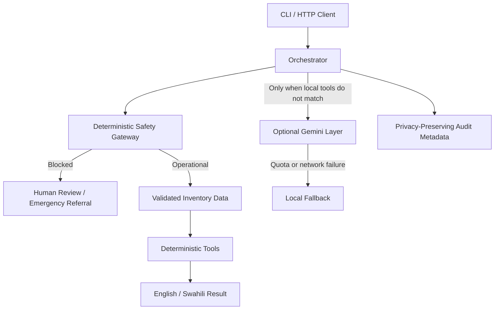

# Runtime Architecture

## Design choices

- Safety routing occurs before model access.
- Factual inventory calculations never depend on the LLM.
- Raw prompts are not stored in audit logs.
- The HTTP server disables model calls unless `AFYAINTEL_ALLOW_MODEL=true`.
- Procurement and clinical actions remain outside the agent's permissions.
