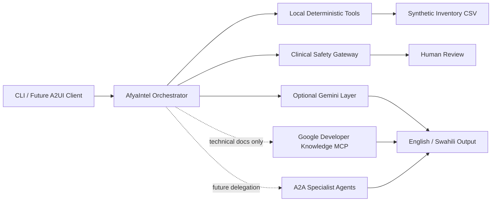

# AfyaIntel Tool and Interoperability Architecture

## Current Local Tools

| Tool | Purpose | Input | Output | Type | Permission |
|---|---|---|---|---|---|
| `load_stock_data` | Validate and read inventory | CSV path | Structured stock records | Deterministic | Read-only local file |
| `get_low_stock` | Calculate threshold breaches | Stock records | Ordered shortage list | Deterministic | In-memory only |
| `get_expiring_items` | Calculate 30-day expiry risk | Stock records and date | Item/day pairs | Deterministic | In-memory only |
| `find_item` | Match a named inventory item | Query and records | One item or none | Deterministic | In-memory only |
| `build_weekly_report` | Draft management summary | Records, language, date | Markdown report | Deterministic | Read-only |
| `evaluate_clinical_safety` | Block unsafe clinical requests | User text | Safety decision | Deterministic | No external access |
| `call_gemini` | Explain open-ended operations topics | Safe text only | Natural-language response | Generative | Restricted API |

## Interoperability Mapping

## MCP Policy

Approved purpose:

- Retrieve current official technical documentation for Google SDKs, MCP configuration, and deployment guidance.

Prohibited purpose:

- Patient records
- Confidential facility data
- API keys
- Clinical decision-making

## Future Agent Cards

Potential specialist agents:

- Inventory Monitoring Agent
- Reporting Agent
- Translation Quality Agent
- Supervisor Escalation Agent

Every agent card should state capabilities, input schema, output schema, authentication, data retention, safety boundary, and human-approval requirements.

## Failure Handling

- MCP unavailable: continue local operation and mark documentation lookup unavailable.
- Gemini quota exhausted: continue local tools without raw provider errors.
- Invalid stock data: stop factual processing and request human data correction.
- A2A agent unavailable: do not silently substitute an unverified agent.
