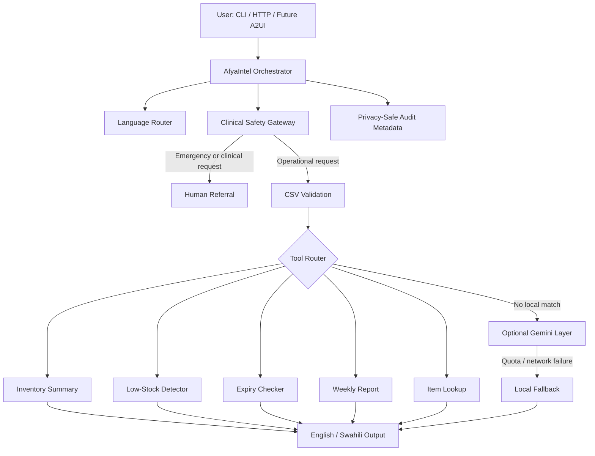

# AfyaIntel Technical Architecture

## Design Principle

**Deterministic before generative.** Inventory facts and safety decisions must be calculated by testable code. A model may improve wording or explain non-clinical concepts, but it must not invent stock values or override safety rules.

## Runtime Flow

## Components

### Orchestrator

Selects the safe execution path and records metadata. It does not give the model direct control over files, payments, or clinical actions.

### Deterministic tools

- `load_stock_data`
- `get_low_stock`
- `get_expiring_items`
- `find_item`
- `build_weekly_report`
- `evaluate_clinical_safety`
- `detect_language`

### Optional model layer

Used only for open-ended, non-clinical operational explanations. Responses are cached, quota failures are handled cleanly, and model access is disabled in the HTTP server by default.

### Audit layer

Stores timestamp, query hash, language, execution path, and safety flags. Raw prompts are intentionally excluded.

## Interoperability

### MCP

Approved use: official technical documentation and carefully scoped operational systems. Prohibited use: patient records, secrets, unrestricted file access, or clinical decision-making.

### A2A

A draft `agent-card.json` documents capabilities and boundaries. The prototype is not exposed as a live A2A endpoint.

### A2UI

A declarative dashboard schema defines approved metrics, alert lists, inventory tables, and human-approval notices. The client, not the model, controls rendering.

### Agent Skills

The project includes an on-demand stock-operations Skill with scripts, references, and evaluation cases.

## Deployment

The standard-library HTTP service provides:

- `GET /health`
- `GET /api/summary?lang=en|sw`
- `GET /api/report?lang=en|sw`
- `POST /api/query`

The Docker image defaults to local-only model behavior. Authentication and Secret Manager are required before any public deployment.
